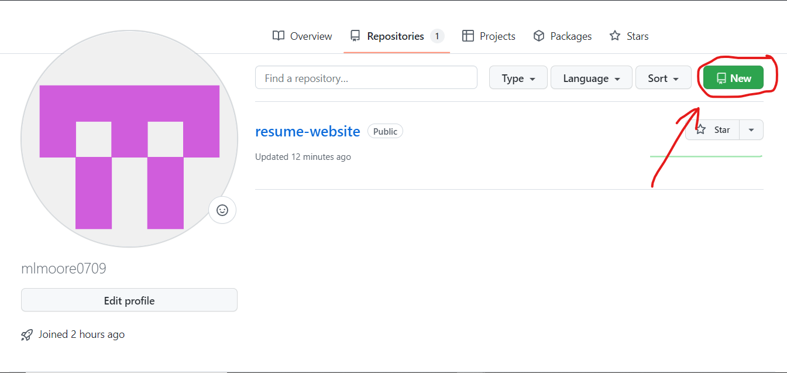
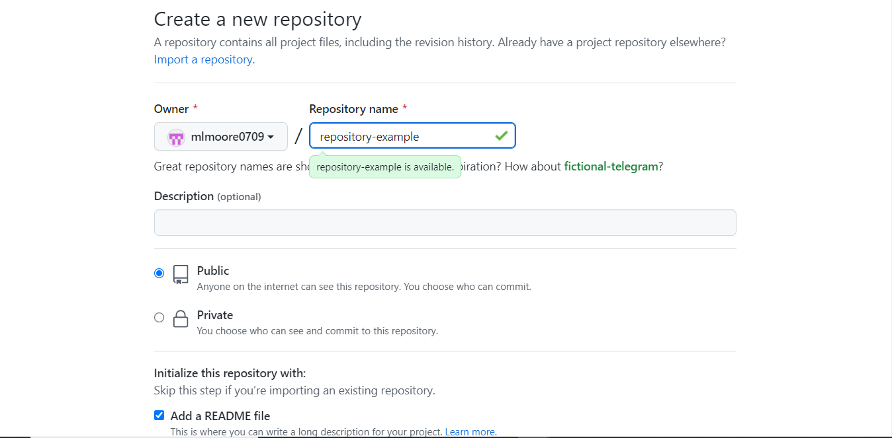
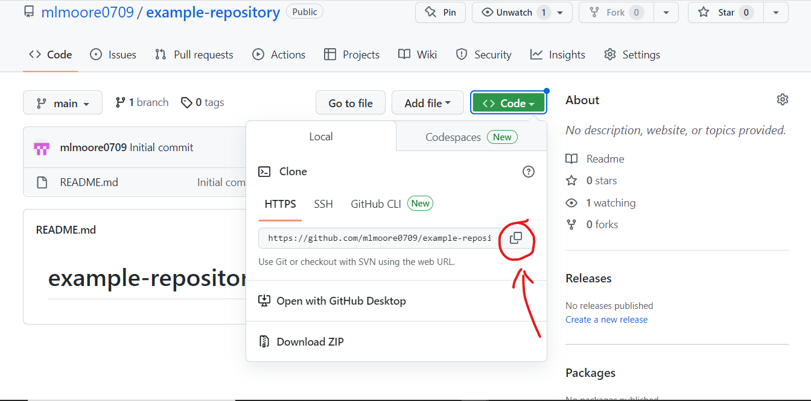

# Personal Resume Website

By Melanie Moore
A simple website that showcases my past work experiences and recent programming skills.

## Technologies Used
* HTML
* CSS

## Getting Familiar with GitHub

### Creating a New Repository
* Clicked the 'New' icon.


* Create a repository name. You also have the choice to make your project 'Public' or 'Private' and add a READMe.


* Once you have created your repository you can now have the option to save your project to your local machine.


## Cloning Repository to Local Machine.
* Open the terminal and enter the command within the directory you want to save your project.
  ```
  git clone https://github.com/mlmoore0709/example-repository.git
  ```
* Now open an IDE of your choice and choose the folder that you have cloned from your git repository.

## Useful Git Commands
* Creating a different branch locally.
  ```
  git branch <BRANCH_NAME>

  //Example
  git branch add-links
  ```
* Switch to a different branch.
* Update your local work by pulling code from the remote repository.
  ```
  git pull origin <BRANCH_NAME>

  //Example
  git pull origin add-links
  ```
* Push changes to the remote repository.
  ```
  //Add changes in your local repository.
  git add <FILE_NAME>

  //Or add all files with changes.
  git add .

  //Commit changes in your local repository.
  git commit -m <COMMIT_MESSAGE>
  git commit -m "commit message"

  //Push changes to the remote repository.
  git push origin <BRANCH_NAME>
  git push origin add-links
  ```
* Rebasing
  ```
  //Rebasing is a way to integrate changes from one branch to another.
  git rebase <BRANCH_NAME>
  git rebase master
    or
  git rebase -i <BRANCH_NAME>
  ```
* Cleaning your commit history
  ```
  //The number 3 after HEAD is the number latest commits you want displayed
  git rebase -i HEAD~3

  //The squash command removes the third commit from the local repository.
  pick "commit message one"
  pick "commit message two"
  squash "commit message three"

  //This the commit list after squashing.
  pick "commit message one"
  pick "commit message two"
  ```

